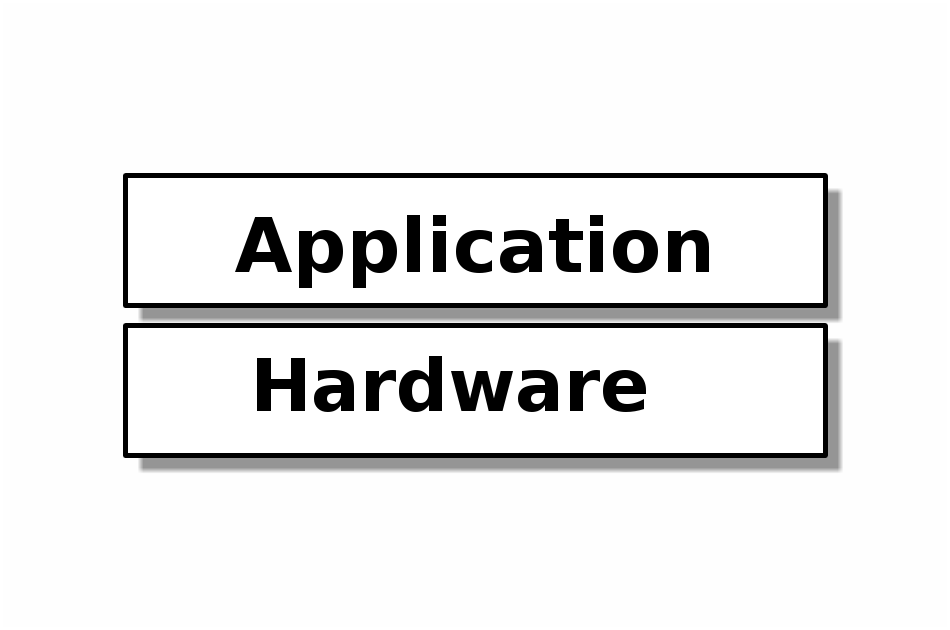
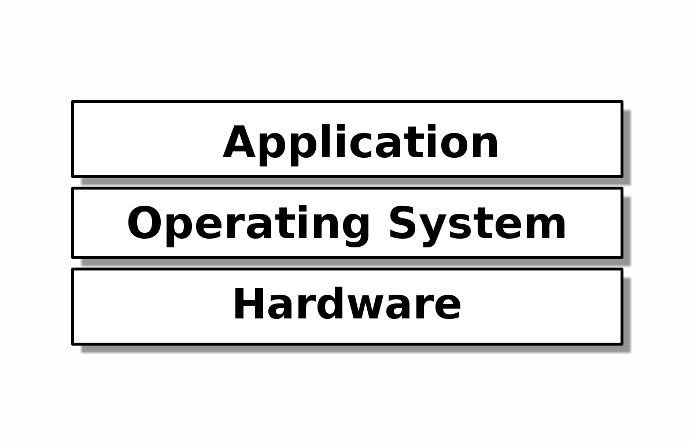
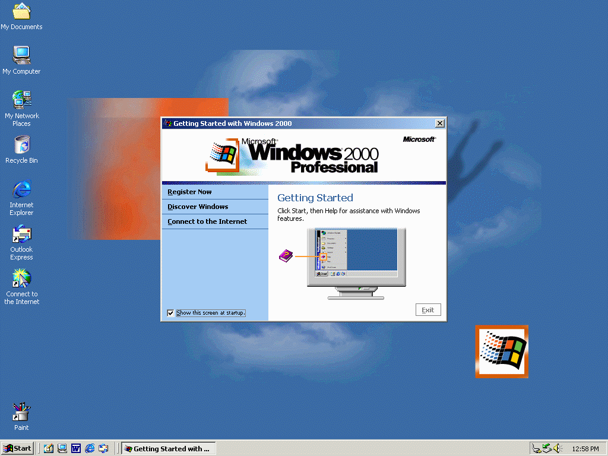
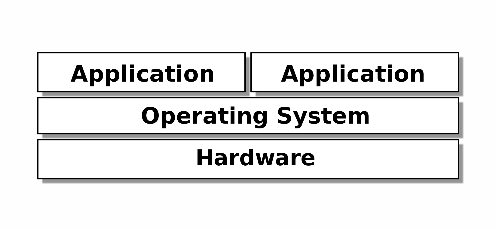
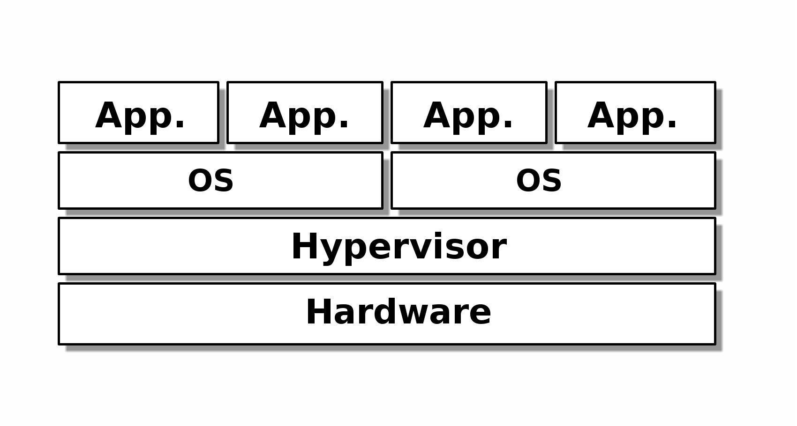
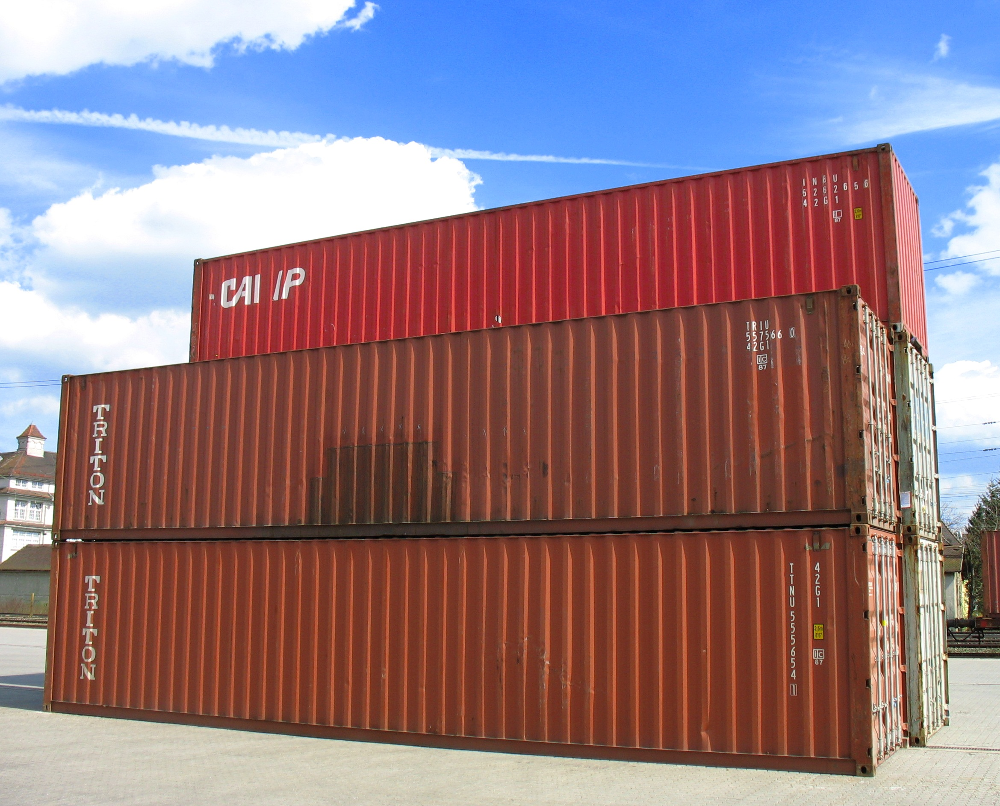
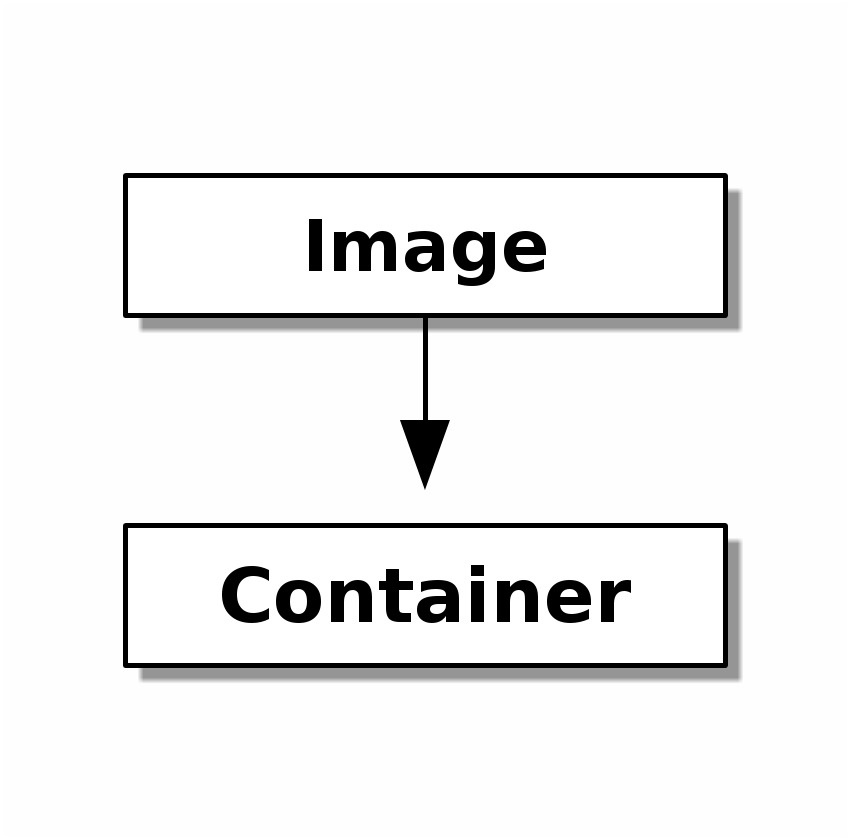
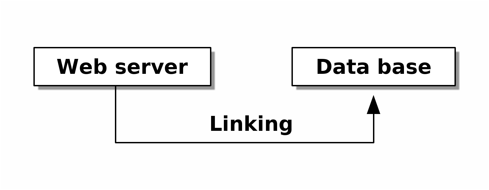

=======================================
The Future of Applications in the Cloud
=======================================

-----------------------------------
Containers and OS-less Applications
-----------------------------------

:Author: Johannes Krampf

Background
==========

Bare-metal programming
----------------------
.. image:: images/punch.jpg

Architecture
------------
..
    +-------------+
    | Application |
    +-------------+
    |  Hardware   |
    +-------------+

Single-tasking Operating System
-------------------------------
.. image:: images/apple2.jpg

Architecture
------------
..
    +------------------+
    |    Application   |
    +------------------+
    | Operating System |
    +------------------+
    |     Hardware     |
    +------------------+

Multi-tasking Operating System
------------------------------

Architecture
------------
..
    +-------------+-------------+
    | Application | Application |
    +-------------+-------------+
    |      Operating System     |
    +---------------------------+
    |          Hardware         |
    +---------------------------+

Cloud
-----

Architecture
------------
..
    +------+------+------+------+
    | App. | App. | App. | App. | 
    +------+------+------+------+
    |     OS      |     OS      |
    +-------------+-------------+
    |         Hypervisor        |
    +---------------------------+
    |          Hardware         |
    +---------------------------+

Advantages
----------

- Can use unmodified legacy applications
- Hardware consolidation
- Scaling and migrations

Problems
--------

- Overhead due to duplication
- Higher memory usage
- Slow start-up time

Solution 1: Container
=====================

Container
---------

Architecture
------------
..
    +------+------+------+------+
    | App. | App. | App. | App. | 
    +------+------+------+------+
    |  Container  |  Container  |
    +-------------+-------------+
    |      Operating System     |
    +---------------------------+
    |          Hardware         |
    +---------------------------+
.. image:: images/architecture-container.png

Docker - Concepts
-----------------
..
    +-----------+
    |   Image   |
    +-----+-----+
          |
          V
    +-----+-----+
    | Container |
    +-----------+

Docker - Constructing a container
---------------------------------

Goal:
  Create a web server

---

Dockerfile::

  FROM nginx
  ADD . /usr/local/nginx/html

.. code:: bash

  $ docker build .
  $ docker run -dP <id> /usr/local/sbin/nginx
  $ docker port <id> 80

Docker - Create an image manually
---------------------------------

.. code:: bash

  $ docker pull ubuntu:14.04
  $ docker run ubuntu apt-get install -qq zip
  $ docker ps -l
  $ docker commit <id> demo/zip

Docker - Linking containers
---------------------------
..
    +------------+     +-----------+
    | Web server |     | Data base |
    +-----+------+     +-----+-----+
          |                  ^
          |      Linking     |
          +------------------+

Private networking between containers

Docker - Deployment
-------------------

1. Pull Image *or* Build from Dockerfile
2. Run one or more containers

Docker - Advantages and Use cases
---------------------------------

Advantages:

- Lightweight and fast
- Easy scaling
- Easy deployment and development
- Portability of containers

Use cases for us:

- Development -> Testing -> Deployment cycle
- Collaboration between developers
- Easy deployment to external server
