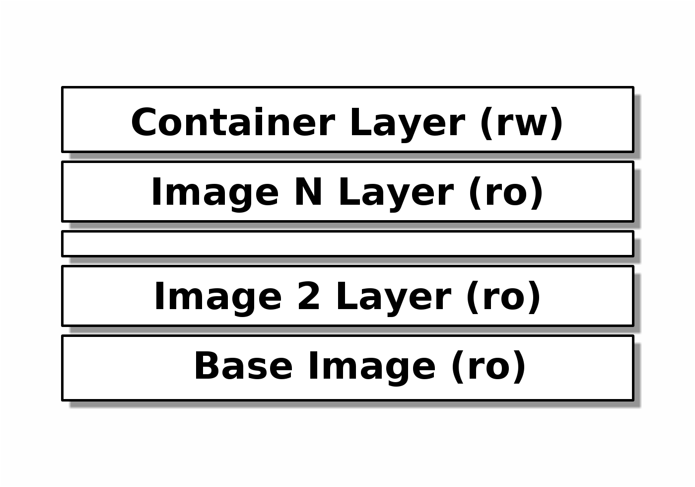
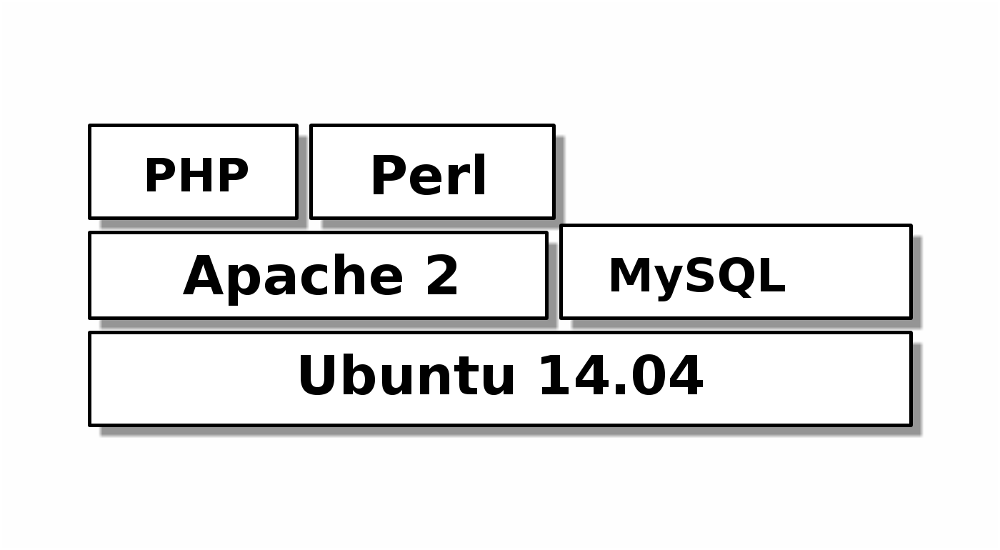

=======================================
The Future of Applications in the Cloud
=======================================

-----------------------------------
Containers and OS-less Applications
-----------------------------------

:Author: Johannes Krampf

Background - Running Applications
=================================

Bare-metal programming
----------------------
.. image:: images/punch.jpg

Architecture
------------
..
    +-------------+
    | Application |
    +-------------+
    |  Hardware   |
    +-------------+
.. image:: images/architecture-bare.png

Single-tasking Operating System
-------------------------------
.. image:: images/apple2.jpg

Architecture
------------
..
    +------------------+
    |    Application   |
    +------------------+
    | Operating System |
    +------------------+
    |     Hardware     |
    +------------------+
.. image:: images/architecture-singletask.png

Multi-tasking Operating System
------------------------------

Architecture
------------
..
    +-------------+-------------+
    | Application | Application |
    +-------------+-------------+
    |      Operating System     |
    +---------------------------+
    |          Hardware         |
    +---------------------------+
.. image:: images/architecture-multitask.png

Cloud
-----
.. image:: images/cloud.jpg

Architecture
------------
..
    +------+------+------+------+
    | App. | App. | App. | App. | 
    +------+------+------+------+
    |     OS      |     OS      |
    +-------------+-------------+
    |         Hypervisor        |
    +---------------------------+
    |          Hardware         |
    +---------------------------+
.. image:: images/architecture-cloud.png

Advantages
----------

- Can use unmodified legacy applications
- Hardware consolidation
- Scaling and migrations

Problems
--------

- Overhead due to duplication
- Higher memory usage
- Slow start-up time

Solution 1: Container
=====================

Container
---------
.. image:: images/container.jpg

Architecture
------------
..
    +-------------+-------------+
    | Application | Application | 
    +-------------+-------------+
    |  Container  |  Container  |
    +-------------+-------------+
    |      Operating System     |
    +---------------------------+
    |          Hardware         |
    +---------------------------+
.. image:: images/architecture-container.png

Docker - Advantages and Use cases
---------------------------------

Advantages:

- Lightweight and fast
- Easy deployment and development
- Portability of containers

Use cases for us:

- Development -> Testing -> Deployment cycle
- Hadoop + Hadoop jobs
- Easy deployment to external server

Docker - Concepts
-----------------
..
  +---------------+
  : Repository    |
  | +-----------+ |
  | |   Image   | |
  | +-----+-----+ |
  +-------|-------+
          |
          V
    +-----+-----+
    | Container |
    +-----------+
.. image:: images/docker.png

Docker - Concepts - Image
-------------------------
..
   +----------------------+
   | Container Layer (rw) |
   +----------------------+
   |  Image N Layer (ro)  |
   +----------------------+
   +----------------------+
   |  Image 2 Layer (ro)  |
   +----------------------+
   |    Base Image (ro)   |
   +----------------------+

Docker - Images example
-----------------------
..
    +-----+------+
    | PHP | Perl |
    +-----+------+---------+
    |  Apache 2  |  MySQL  |
    +------------+---------+
    |     Ubuntu 14.04     |
    +----------------------+

Docker - Concepts - Container
-----------------------------

- Environment for executing an application
- Based on an image
- Isolated from other containers/processes
- Networking between containers or with host
- Resources (CPU, Memory, I/O) can be limited

Docker - Constructing a container
---------------------------------

Goal:
  Create a web server

Dockerfile::

   FROM ubuntu:14.04
   RUN apt-get install -y lighttpd
   ADD demo-http-files /var/www
   EXPOSE 80
   CMD ["/usr/sbin/lighttpd", "-D", \
        "-f", "/etc/lighttpd/lighttpd.conf"]

.. code:: bash

   $ docker build -t webserver web-demo
   $ docker run -dP webserver
   $ docker port <id> 80

Docker - Create an image manually
---------------------------------

.. code:: bash

    $ docker pull ubuntu:14.04
    $ docker run ubuntu apt-get install -y netcat
    $ docker ps -l
    $ docker commit <id> demo/nc

Docker - Linking containers
---------------------------
..
    +------------+     +-----------+
    | Web server |     | Data base |
    +-----+------+     +-----+-----+
          |                  ^
          |        Link      |
          +------------------+
.. image:: images/linking.png

Private networking between containers

Ping-Pong linking example
-------------------------

Pong-Server:

.. code:: bash

    $ docker run --name pong demo/nc sh -c "
    while true; do\
        echo pong | nc -l 12345;\
    done"

Ping-Client:

.. code:: bash

    $ docker run --link pong:pong demo/nc sh -c "
    echo ping $(date) | nc pong 12345"

Docker - Deployment
-------------------

1. Pull Image *or* Build from Dockerfile
2. Run one or more containers

Solution 2: OS-less Applications
================================

OS-less Applications - OpenMirage
---------------------------------
.. image:: images/mirage.jpg

Architecture
------------
..
    +-------------+-------------+
    | Application | Application | 
    +-------------+-------------+
    |         Hypervisor        |
    +---------------------------+
    |          Hardware         |
    +---------------------------+
.. image:: images/architecture-mirage.png

Questions
=========
